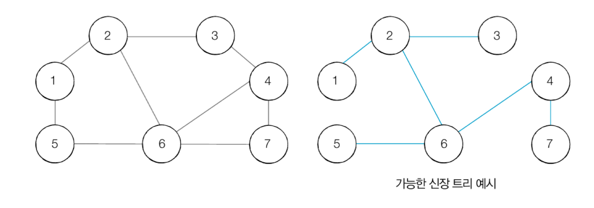
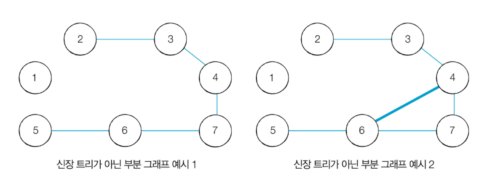
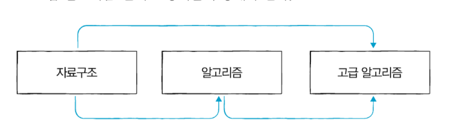

그래프 이론
========

서로소 집합 자료구조
---------------
사로조 집합 자료구조를 구현할 때는 트리 자료구조를 이용하여 집합을 표현한다.

각 노드가 서로소 관계를 계산한 것이다.

서로소 집합 알고리즘 시간 복잡도는 아래와 같다.

노드의 개수가 V개, 최대 V-1개의 union 연산, M개의 find 연산

$O(V + M(1 + log_{2-M/V}V))$

대락 $O(V + Mlog_2V)$

서로소 집합 활용 부분
----------------
서로소 집합은 무방향 그래프 내에서의 사이클을 판별할 때 사용할 수 있다.

참고로 방향 그래프에서의 사이클 여부는 DFS를 이용하여 판별할 수 있다.

신장 트리
-------
기본적으로 신장 트리란 

`하나의 그래프가 있을 때 모든 노드를 포함하면서 사이클이 존해하지 않는 부분 그래프`

를 의미 한다.

이때 모든 노드가 포함되어 서로 연결되면서 사이클이 존재하지 않는다는 조건은 

`트리의 성립 조건`이기도 하다.

왼쪽은 신장 트리가 아님, 오른쪽은 신장 트리임

크루스칼 알고리즘
-------------
신장 트리 중에서 최소 비용으로 만들 수 있는 신장 트리를 찾는 알고리즘을

`최소 신장 트리 알고리즘`이라고 한다.

대표적인 최소 신장 트리 알고리즘으로는 `크루스칼 알고리즘`이 있다.

`크루스칼 알고리즘`은 그리디 알고리즘으로 분류된다.

크루스칼 알고리즘의 시간 복잡도는 간선 E를 가지고 있을 때 $O(ElogE)$의 시간 복잡도를 가진다.

위상 정열
-------
위상 정렬은 정렬 알고리즘의 일종이다.

위상 정렬은 순서가 정해져 있는 일련의 작업을 차례대로 수행해야 할 때 사용할 수 있는 알고리즘이다.

위상 정렬이란, `방향 그래프의 모든 노드를 방향성에 거스르지 않도록 순서대로 나열하는 것`이다.

> 진입 차수  
> 진입 차수란 특정 한 노드로 '들어오는' 간선의 개수를 의미한다.  
> 예를 들어 
> 
> 위와 같은 상황에서 '고급 알고리즘' 노드는 2개의 선수과목을 가진다.

위상 정렬 알고리즘 특징
------------------
1. 진입차수가 0인 노드를 큐에 넣는다.
2. 큐가 빌 떄까지 다음의 과정을 반복한다.
    - 큐에서 원소를 꺼내 해당 노드에서 출발하는 간선을 그래프에서 제거한다.
    - 새롭게 진입차수가 0이 된 노드를 큐에 넣는다.

> 모든 원소를 방문하기 전에 큐가 빈다면 사이클이 존재한다고 판단할 수 있다.

위상 정렬 알고리즘 복잡도
-------------------
시간 복잡도는 $O(V + E)$이다.

위상 정렬을 수행할 때는 차례대로 모든 노드를 확인하면서,

해당 노드에서 출발하는 간선을 차례대로 제거해야 한다.